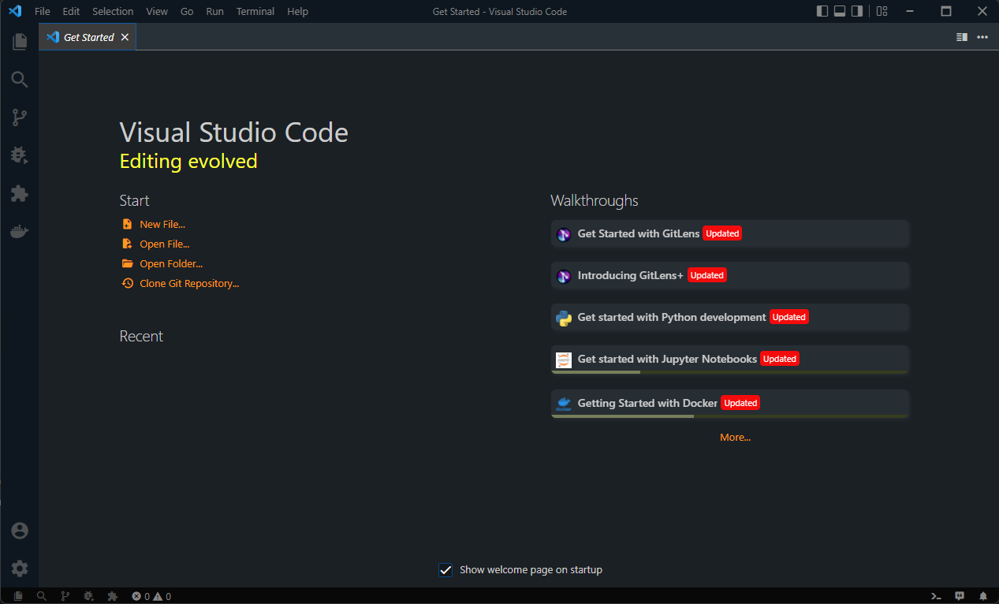
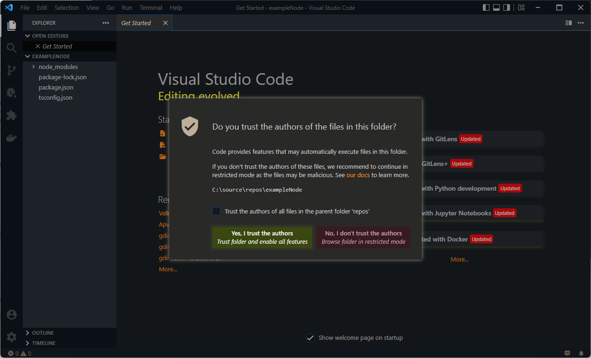
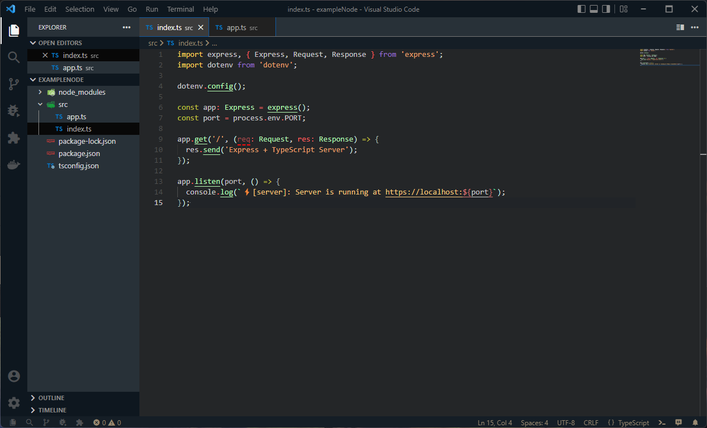

<!-- 

  

 -->

<h1 align="center">Valkthor Theme</h1>

  
  
  

---

I started this theme based in deepdark-material, but then I have been completely modifying it, to the point that it is no longer like the original, but rather a new one.

I've been improving and changing it as I use it, you know, so it doesn't hurt your eyes and all that.

## ScreenShots Preview

